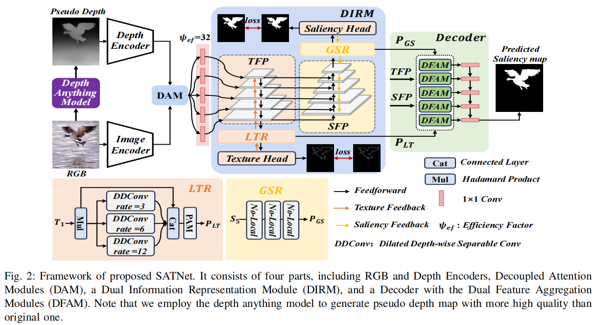
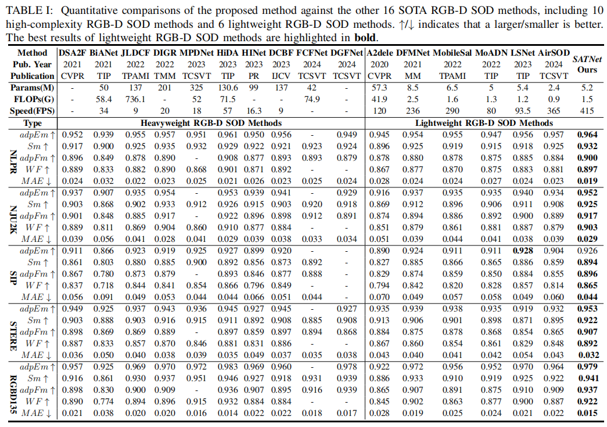
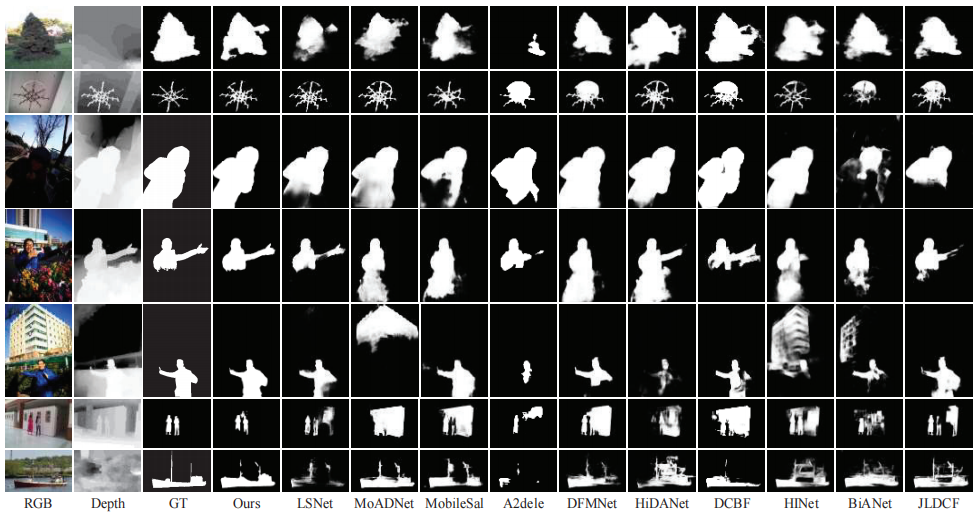
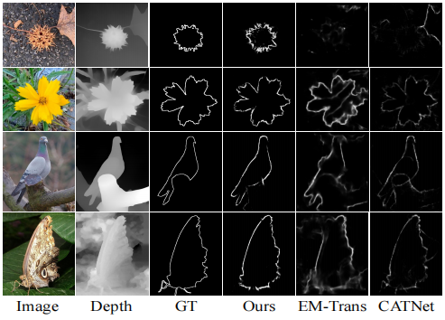
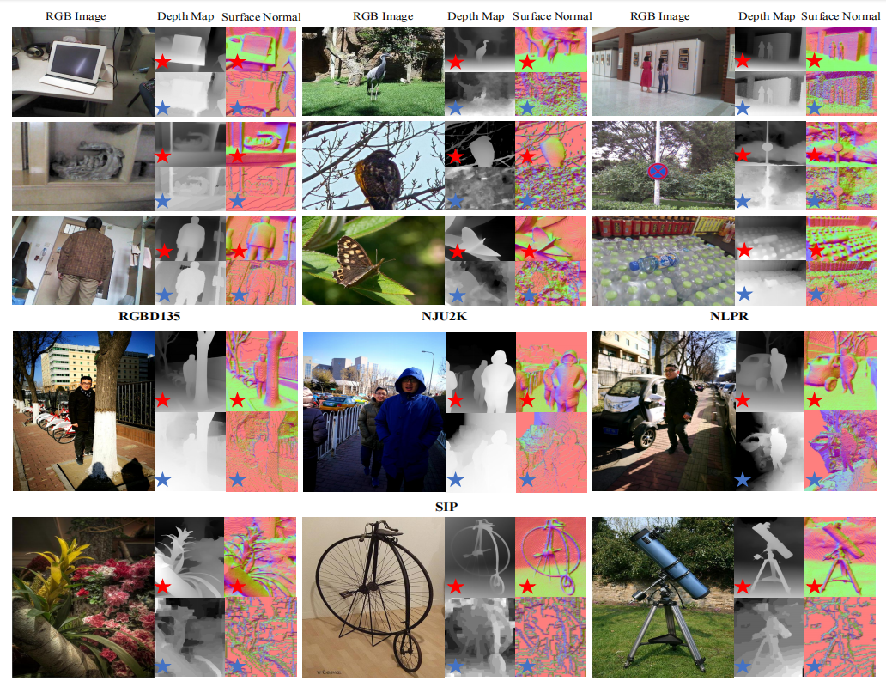

# **Lightweight RGB-D Salient Object Detection from a Speed-Accuracy Tradeoff Perspective**

## SATNet
TIP 2025 [[Paper]](https://arxiv.org/pdf/2505.04758)

## Network Architecture


## Performance 
We perform quantitative comparisons and qualitative comparisons with 16 RGB-D SOD methods on five RGB-D datasets.


## Saliency maps and Edge Maps



### Prerequisites
- Python 3.8
- Pytorch 2.0.0
- Torchvision 0.15.1
- Numpy 1.19.2

### Pseudo Depth maps generated by Depth Anything
In our SATNet, we use vision foundation model (Depth Anything Model) to generate high-quality depth maps.

The generated pseudo depth maps can be obtained in this [link](https://drive.google.com/drive/folders/1kQy6MPQ8HTYcYo3Ubeh5mWq-M924v5oF?usp=drive_link)


### Datasets
- [Train Datasets](https://pan.baidu.com/s/148IZcZAB5qSSWBJYzhvoYw) with the fetch code:1234.
- [Test Datasets](https://pan.baidu.com/s/18dbNDpkV7hV43UOW7v8huA) with the fetch code:1234.

### Results
You can download the tested results map at

- [Google Drive](https://drive.google.com/file/d/17WZ25asz9oH5qP19onSsly6eBmDoMrTi/view?usp=sharing)

- [baidu Netdisk](https://pan.baidu.com/s/1QixLFPOT9tXA5XbKhXtKBQ?pwd=sat1) with the fetch code: sat1


### Contact
Feel free to send e-mails to me (duanss@stu.xidian.edu.cn).
``` bibtex
@article{duan2025lightweight,
  title={Lightweight RGB-D Salient Object Detection from a Speed-Accuracy Tradeoff Perspective},
  author={Duan, Songsong and Yang, Xi and Wang, Nannan and Gao, Xinbo},
  journal={IEEE Transactions on Image Processing},
  year={2025},
  publisher={IEEE}
}
```

## Ackonwledge
Many thanks for Depth Anything: [[paper]](https://arxiv.org/pdf/2401.10891) [[Project]](https://depth-anything.github.io/)
``` bibtex
@inproceedings{yang2024depth,
  title={Depth anything: Unleashing the power of large-scale unlabeled data},
  author={Yang, Lihe and Kang, Bingyi and Huang, Zilong and Xu, Xiaogang and Feng, Jiashi and Zhao, Hengshuang},
  booktitle={Proceedings of the IEEE/CVF Conference on Computer Vision and Pattern Recognition},
  pages={10371--10381},
  year={2024}
}
```

Many thanks for MobileNetV2: [[paper]](https://arxiv.org/pdf/1801.04381)
``` bibtex
@inproceedings{sandler2018mobilenetv2,
  title={Mobilenetv2: Inverted residuals and linear bottlenecks},
  author={Sandler, Mark and Howard, Andrew and Zhu, Menglong and Zhmoginov, Andrey and Chen, Liang-Chieh},
  booktitle={Proceedings of the IEEE/CVF Conference on Computer Vision and Pattern Recognition},
  pages={4510--4520},
  year={2018}
}
```
 
